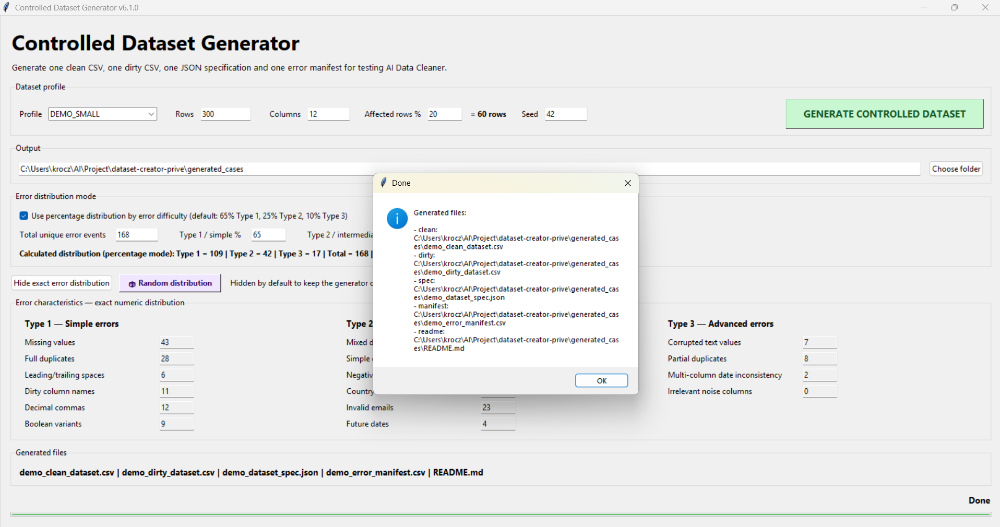
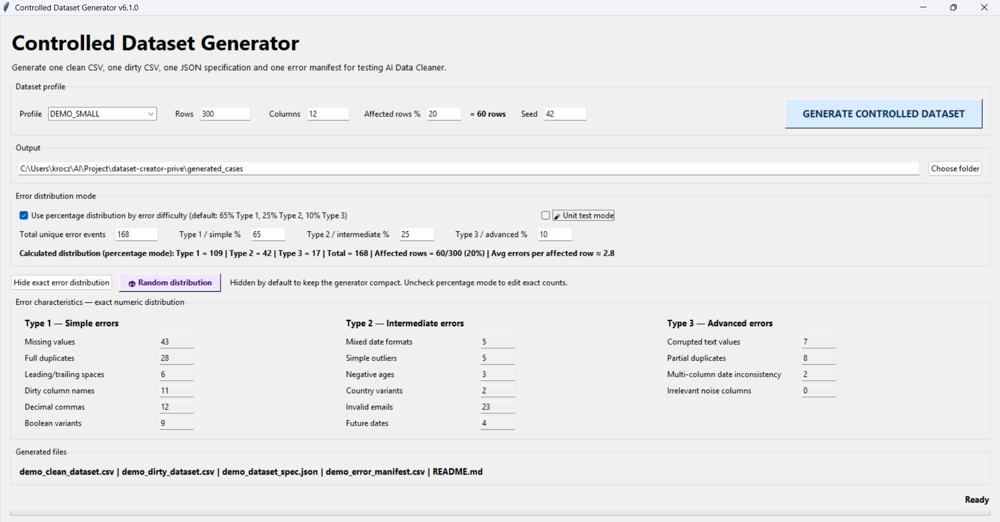
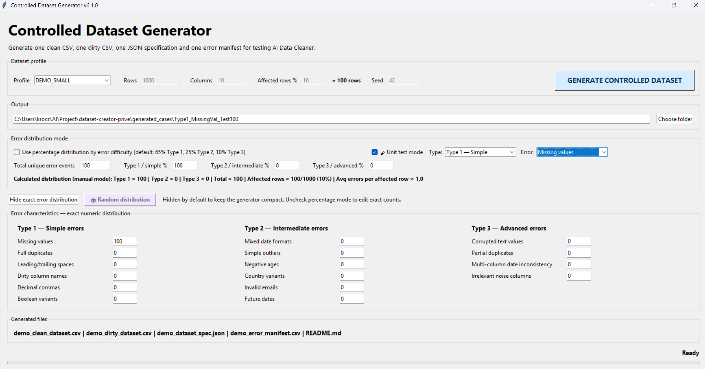

# Controlled Dataset Generator — v6.1

A local, offline tool to generate controlled dirty datasets and ground-truth files for benchmarking AI data cleaning pipelines.
Supports three error difficulty levels, isolated unit-test generation per error type, and fully reproducible output via seed control.

---

## Purpose

This tool was built as the **test harness** for an AI Data Cleaner project.
It generates pairs of datasets — one clean, one dirty — where every injected error is fully documented in a machine-readable manifest.
The cleaner can then be evaluated objectively: did it detect the right errors? Did it fix them correctly? Did it introduce false modifications?

Three modes cover the full evaluation spectrum:

- **Percentage mode** — distribute a total error budget across Type 1 / Type 2 / Type 3 difficulty levels using configurable percentages; sub-type allocation is randomized within each level.
- **Unit test mode** — isolate a single error sub-type (e.g. `invalid_emails`, `partial_duplicates`) with a fixed, predictable output for surgical regression testing of one cleaning behaviour at a time.
- **Seed control** — any generation run is fully reproducible by fixing the random seed; omitting it produces a different distribution on each run.

---

## Demo

🚧 Demo video currently in preparation.

[](https://youtu.be/VIDEO_ID)

<!-- Replace VIDEO_ID with the YouTube video id, and add docs/images/demo-thumbnail.png -->

---

## Screenshots

### Dataset profile & generation

Configure rows, columns, affected-row percentage and seed, then generate a clean/dirty dataset pair in one click.



### Error distribution mode

Distribute a total error budget across Type 1 / Type 2 / Type 3 difficulty levels, or switch to manual exact counts.



### Unit test mode

Isolate a single error sub-type with a fixed, predictable output for surgical regression testing.



---

## Architecture

```
┌─────────────────────────────────────────────┐
│           Tkinter GUI (Python)              │
│  ┌──────────────┐   ┌─────────────────────┐ │
│  │ Dataset      │   │ Error Distribution  │ │
│  │ Profile      │   │ Mode                │ │
│  │ rows/cols/   │   │ % mode / manual /   │ │
│  │ seed/profile │   │ unit test mode      │ │
│  └──────┬───────┘   └────────┬────────────┘ │
│         └──────────┬─────────┘              │
│              GENERATE                       │
└──────────────┬──────────────────────────────┘
               │
               ▼
┌──────────────────────────────────────────────┐
│           Generation Engine                  │
│                                              │
│  ┌────────────────┐  ┌──────────────────┐   │
│  │ Clean Dataset  │  │ Error Injector   │   │
│  │ Builder        │  │ Type 1 / 2 / 3   │   │
│  │ (pandas/numpy) │  │ row-level +      │   │
│  │                │  │ schema-level     │   │
│  └───────┬────────┘  └────────┬─────────┘   │
│          └─────────┬──────────┘             │
└───────────────────┬──────────────────────────┘
                    │
                    ▼
┌───────────────────────────────────────────────┐
│               Output Folder                   │
│                                               │
│  demo_clean_dataset.csv   ← ground truth      │
│  demo_dirty_dataset.csv   ← input for cleaner │
│  demo_dataset_spec.json   ← count summary     │
│  demo_error_manifest.csv  ← injected errors   │
│  README.md                ← run metadata      │
└───────────────────────────────────────────────┘
```

---

## Technology Stack

| Layer | Technology |
|---|---|
| Language | Python 3 |
| GUI | Tkinter / ttk |
| Data manipulation | pandas, numpy |
| Output formats | CSV, JSON |
| Runtime | Local only — no API, no internet, no database |

---

## Error Difficulty Model

| Type | Level | Description |
|---|---|---|
| Type 1 | Simple | Missing values, full duplicates, decimal commas, boolean variants, leading/trailing spaces, dirty column names |
| Type 2 | Intermediate | Mixed date formats, simple outliers, negative ages, country variants, invalid emails, future dates |
| Type 3 | Advanced | Corrupted text, partial duplicates, multi-column date inconsistencies, irrelevant noise columns |

Each error is recorded as a unique event `(row_id, column, error_type)` in the manifest.
Schema-level errors (dirty column names, noise columns) are counted once per affected column, not once per cell.

---

## Version History

### v6.1 — Unit Test Mode fixes *(current)*
- Fixed Type/Error dropdowns pushed off-screen (placed on dedicated row, full width)
- Fixed Error subtype dropdown showing only one item due to duplicate method definitions in Python
- Fixed preset values (rows, total, %) not being written to fields — guard condition was comparing display labels against internal keys

### v6.0 — Unit Test Mode
- New "Unit test mode" checkbox: generates a single-error-type dataset in one click
- Auto-sets: 1000 rows, 10 columns, 10% affected rows, 100 total errors
- Output folder auto-named: `Type{N}_{ShortCode}_Test100` (e.g. `Type1_MissingVal_Test100`)
- Snapshot save/restore on mode entry/exit

### v5.2 — Manual Mode header fields editable
- Fixed: typing in Total or % fields was immediately overwritten by auto-recalculation
- Added `_editing_manual_header` flag to prevent back-calculation during user input

### v5.1 — Hide/Show button definitive fix
- Fixed: Hide button had no effect after clicking Random distribution
- Added `_toggling_visibility` re-entry guard to prevent trace callbacks from reopening the panel

### v4.2 — Random distribution button
- One-click randomization of sub-type distribution respecting all physical bounds
- Fresh seed per click, works in both percentage and manual mode

### v4.1 — Input bounds validation
- Pre-flight validation before generation: warns user when requested counts exceed dataset limits
- Prevents silent truncation of error counts (e.g. 100 dirty column names on a 10-column dataset)

### v4.0 — Row-impact model
- Replaced simple total-error counting with a row-impact model:
  - **Affected rows %**: percentage of rows that can receive errors
  - **Total unique error events**: distributed across affected rows
- Randomized sub-type distribution within each difficulty type
- Richer JSON specification with row-level vs schema-level separation

### v3.x — Stability and dtype fixes
- Error injection stabilized across boolean, numeric, and text column types
- Mixed dirty values accepted while clean dataset remains intact

### v1–v2 — MVP
- Initial local Tkinter GUI
- Basic clean/dirty dataset generation with CSV, JSON, and manifest output

---

## Key Design Decisions

**One manifest row = one unique injected error event.**
The same `(row_id, column, error_type)` is never counted twice.
Multiple different errors can exist on the same affected row.
This makes evaluation precise: detection rate and cleaning rate are computed on a well-defined set.

**Schema-level errors are counted once per column, not per cell.**
Adding a noise column of 1,000 rows counts as 1 error event, not 1,000.
This prevents the benchmark from being dominated by a single schema decision.

**100% local.**
No API call, no cloud dependency, no authentication. Works offline on any machine with Python.

---

## Installation

### 1. Install Python

Download and install Python 3.10 or higher from [python.org](https://www.python.org/downloads/).

> On Windows: check **"Add Python to PATH"** during installation.

Alternatively, install via winget:

```bash
winget install Python.Python.3.12
```

### 2. Install dependencies

```bash
pip install -r requirements.txt
```

No other packages are required. `tkinter` is bundled with the standard Python installer.

---

## Usage

A ready-to-run copy of the current release (**v6.1**) lives in this folder:
`controlled_dataset_generator.py` and its launcher.

```bash
# Option 1 — double-click launcher
launch_controlled_dataset_generator.bat

# Option 2 — run directly
python controlled_dataset_generator.py
```

### Unit Test Mode (quick start)

1. Check **Unit test mode**
2. Select difficulty type: Type 1 / Type 2 / Type 3
3. Select the specific error sub-type
4. Click **GENERATE CONTROLLED DATASET**

The tool auto-configures all parameters and names the output folder predictably.

---

## Agentic Development Approach

This project was built entirely using a **multi-agent, iterative AI-assisted development workflow** — no traditional sprint planning, no ticket system.

| Phase | Tool | Role |
|---|---|---|
| v1 — Initial prototype | **GitHub Copilot (Microsoft 365)** | First working GUI and generation logic scaffolded via inline completions |
| v2–v5 — Architecture & versioning | **ChatGPT (GPT-4.5)** | Specification writing, AGENTS.md versioning, root cause analysis for UI bugs, iterative refinement of the counting model |
| v6.x — Production code | **Claude (Anthropic)** | Code generation, bug fixes, structured debugging with full file context |

Each version's specification was written as a structured agent instruction file (`AGENTS.md`) before any code was produced.
This allowed the AI model to produce consistent, context-aware code across sessions without manual state management.

The AGENTS.md file acts as a persistent contract between the developer and the AI: it defines rules, invariants, and version history so any model can resume work with full context.

> This workflow demonstrates how a solo developer can ship a production-quality tool across 10+ versions by treating AI models as specialized collaborators rather than autocomplete engines.

---

## Documentation

- [Changelog](docs/CHANGELOG.md) — version-by-version history
- [Roadmap](docs/ROADMAP.md) — planned steps
- [Bug log](docs/BUGS.md) — issues found and resolved
- [Agent approach](docs/AGENTS.md) — how the agent-contract workflow works
- [Tool limits](docs/tool_limits.md) — calibration boundaries and silent shortfalls

---

## Project Status

| Item | Status |
|---|---|
| Core generation | Stable |
| Unit test mode | Stable (v6.1) |
| Benchmark profile (100k rows) | Planned — Step 3 |
| Multiple output formats (XLSX, Parquet) | Planned — Step 4 |
| Evaluation helper script | Planned — Step 5 |
| Batch generation | Planned — Step 9 |
